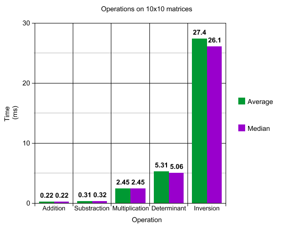
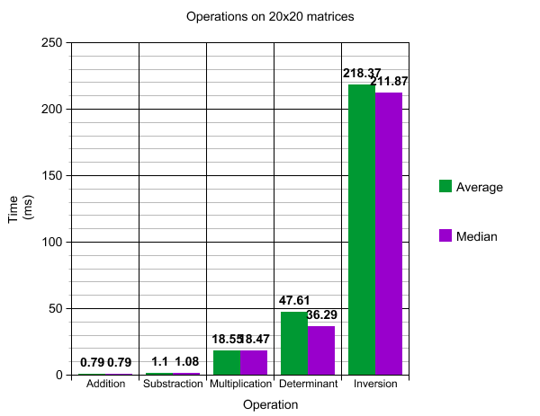
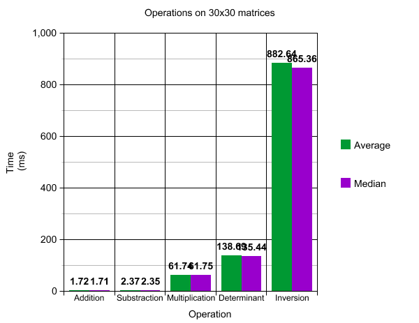
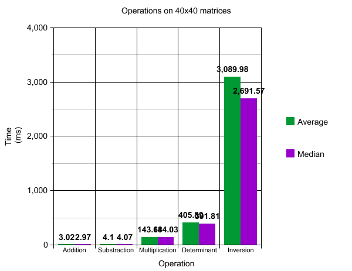
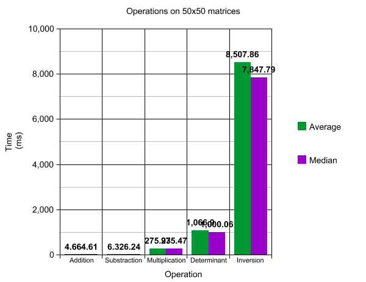

# Testausdokumentti

## Projektin toimivuuden testaaminen
Projektillani on kirjoitushetkellä 120 testiä. Testit koettavat jokaista julkista metodia (pl. käyttöliittymään liittyvät
metodit), ja jokaista julkista metodia kohti on vähintään kuusi testiä.

Matriisilaskutoimituksia testaavat metodit käyttävät sekä kovakoodattuja että satunnaisgeneroituja neliömatriiseita.
Matriisien koko on pääsääntöisesti joko 3x3 tai 10x10, mutta esimerkiski eräs käänteismatriisin laskemista testaava metodi
generoi matriiseita, joiden koko on satunnaisesti valittu kokonaisluku väliltä [2, 20].

Testit kattavat myös Matrix-luokan, sekä omien valmisalgoritmieni toimivuuden. Matrix-luokan testit pitävät huolen siitä, että
matriisin luonti, sekä erityisesti matriisilaskutoimituksissa tärkeät Matrix-luokan metodit toimivat oiken. Omia versioitani
Pythonin valmisagoritmeista on testattu vertaamalla niiden antamia tuloksia Pythonin valmisalgoritmeihin.

Testejä luodessani koitin pitää erityisen hyvää huolta mahdollisten erikoistapausten tarkastelusta. Tämä tuli tarpeeseen
projektin puolessavälissä, kun uusi erikoistapauksen huomioiva testi toi ilmi virheen tärkeässä osassa koodiani.

Testien suorittaminen on hyvin helppoa. Suorittaminen hoituu yksinkertaisesti komennolla
`python3 /path/to/my/project/tests.py`.

## Suorituskyvyn mittaus
Suorituskykytestejä varten loin projektini juureen tiedoston `performance_tests.py`, joka sisältää suorituskykytestin
jokaiselle matriisilaskutoimitukselle. Jokaista matriisilaskutoimitusta on testattu sata kertaa n*n matriiseilla, missä
n=10,20,30,40,50 ja joissa solujen arvot ovat satunnaisgeneroitu kokonaislukuväliltä [-10,10].

Testit ovat helposti toistettavissa. Tämä hoituu suorittamalla projektini juuressa oleva tiedosto `performance_tests.py` esim.
komentoriviltä käsin komennolla `python3 /path/to/my/project/directory/performance_tests.py`. Kannattaa varautua odottamaan
tuloksia vähintään kaksikymmentä minuuttia. Jos kärsivällisyys on kuitenkin vaakalaudalla, voi tiedoston alussa olevaa
globaalia muuttujaa n pienentää sadasta esimerkiksi kymmeneen.

### Tulokset
Alla on muutama pylväsdiagrammi testituloksista. Graafeissa on kuluneen ajan keskiarvo ja mediaani kullekin
laskutoimitukselle. Graafit on jaoteltu matriisin koon mukaan.

Graafeista nähdään, että pääsääntöisesti mediaanit ovat lähellä keskiarvoa. Poikkeuksena kuitenkin käänteismatriisin
laskeminen. Keskiarvo on mediaania huomattavankin paljon suurempi, sillä generoitu satunnaismatriisi saattaa olla
singulaarinen (ts. determinantti 0), jolloin käänteismatriisia ei ole määritelty ja laskenta keskeytyy. Siten nopeimmat
epäsingulaaristen matriisien käännöt ovat listan keskivaiheilla.







Alla on vielä pĺain text muodossa läppärilläni suoritettuna `performance_tests.py`:n antamat tulokset.
```
ADDING TWO 10x10 MATRICES WITH VALUES IN RANGE [-10, 10]
  total time: 22.41200000000004ms
average time: 0.22412000000000043ms
 median time: 0.22199999999999998ms

ADDING TWO 20x20 MATRICES WITH VALUES IN RANGE [-10, 10]
  total time: 79.40400000000031ms
average time: 0.7940400000000031ms
 median time: 0.7854999999999945ms

ADDING TWO 30x30 MATRICES WITH VALUES IN RANGE [-10, 10]
  total time: 171.77499999999878ms
average time: 1.717749999999988ms
 median time: 1.7099999999999893ms

ADDING TWO 40x40 MATRICES WITH VALUES IN RANGE [-10, 10]
  total time: 301.67799999999767ms
average time: 3.0167799999999767ms
 median time: 2.974000000000032ms

ADDING TWO 50x50 MATRICES WITH VALUES IN RANGE [-10, 10]
  total time: 466.1009999999979ms
average time: 4.661009999999979ms
 median time: 4.614999999999814ms

CALCULATING THE DETERMINANT OF A 10x10 MATRIX WITH VALUES IN RANGE [-10, 10]
  total time: 531.1040000000017ms
average time: 5.311040000000017ms
 median time: 5.062000000000122ms

CALCULATING THE DETERMINANT OF A 20x20 MATRIX WITH VALUES IN RANGE [-10, 10]
  total time: 4761.187000000007ms
average time: 47.611870000000074ms
 median time: 36.291000000000295ms

CALCULATING THE DETERMINANT OF A 30x30 MATRIX WITH VALUES IN RANGE [-10, 10]
  total time: 13868.944000000018ms
average time: 138.6894400000002ms
 median time: 135.43600000000123ms

CALCULATING THE DETERMINANT OF A 40x40 MATRIX WITH VALUES IN RANGE [-10, 10]
  total time: 40588.89699999993ms
average time: 405.8889699999993ms
 median time: 391.81249999999324ms

CALCULATING THE DETERMINANT OF A 50x50 MATRIX WITH VALUES IN RANGE [-10, 10]
  total time: 106690.01100000004ms
average time: 1066.9001100000005ms
 median time: 1000.0595000000061ms

INVERTING 10x10 MATRIX WITH VALUES IN RANGE [-10, 10]
  total time: 2738.063000000039ms
average time: 27.38063000000039ms
 median time: 26.05850000000487ms

INVERTING 20x20 MATRIX WITH VALUES IN RANGE [-10, 10]
  total time: 21836.543000000092ms
average time: 218.3654300000009ms
 median time: 211.86899999999298ms

INVERTING 30x30 MATRIX WITH VALUES IN RANGE [-10, 10]
  total time: 88264.06900000015ms
average time: 882.6406900000015ms
 median time: 865.3624999999892ms

INVERTING 40x40 MATRIX WITH VALUES IN RANGE [-10, 10]
  total time: 308998.0830000003ms
average time: 3089.9808300000027ms
 median time: 2691.5690000000154ms

INVERTING 50x50 MATRIX WITH VALUES IN RANGE [-10, 10]
  total time: 850785.9369999998ms
average time: 8507.859369999998ms
 median time: 7847.788999999977ms

MULTIPLYING TWO 10x10 MATRICES WITH VALUES IN RANGE [-10, 10]
  total time: 244.72300000138603ms
average time: 2.4472300000138603ms
 median time: 2.449999999953434ms

MULTIPLYING TWO 20x20 MATRICES WITH VALUES IN RANGE [-10, 10]
  total time: 1854.7859999994216ms
average time: 18.547859999994216ms
 median time: 18.469999999979336ms

MULTIPLYING TWO 30x30 MATRICES WITH VALUES IN RANGE [-10, 10]
  total time: 6174.346999998761ms
average time: 61.74346999998761ms
 median time: 61.749999999847205ms

MULTIPLYING TWO 40x40 MATRICES WITH VALUES IN RANGE [-10, 10]
  total time: 14368.098999999802ms
average time: 143.68098999999802ms
 median time: 144.02899999993224ms

MULTIPLYING TWO 50x50 MATRICES WITH VALUES IN RANGE [-10, 10]
  total time: 27593.108999999684ms
average time: 275.93108999999686ms
 median time: 275.4699999999275ms

SUBSTRACTING TWO 10x10 MATRICES WITH VALUES IN RANGE [-10, 10]
  total time: 31.86599999912687ms
average time: 0.3186599999912687ms
 median time: 0.31349999994745303ms

SUBSTRACTING TWO 20x20 MATRICES WITH VALUES IN RANGE [-10, 10]
  total time: 109.88399999996545ms
average time: 1.0988399999996545ms
 median time: 1.0819999999966967ms

SUBSTRACTING TWO 30x30 MATRICES WITH VALUES IN RANGE [-10, 10]
  total time: 236.54700000020057ms
average time: 2.3654700000020057ms
 median time: 2.352999999857275ms

SUBSTRACTING TWO 40x40 MATRICES WITH VALUES IN RANGE [-10, 10]
  total time: 409.5209999998133ms
average time: 4.095209999998133ms
 median time: 4.0715000000091095ms

SUBSTRACTING TWO 50x50 MATRICES WITH VALUES IN RANGE [-10, 10]
  total time: 631.6969999986668ms
average time: 6.316969999986668ms
 median time: 6.235000000060609ms

```
